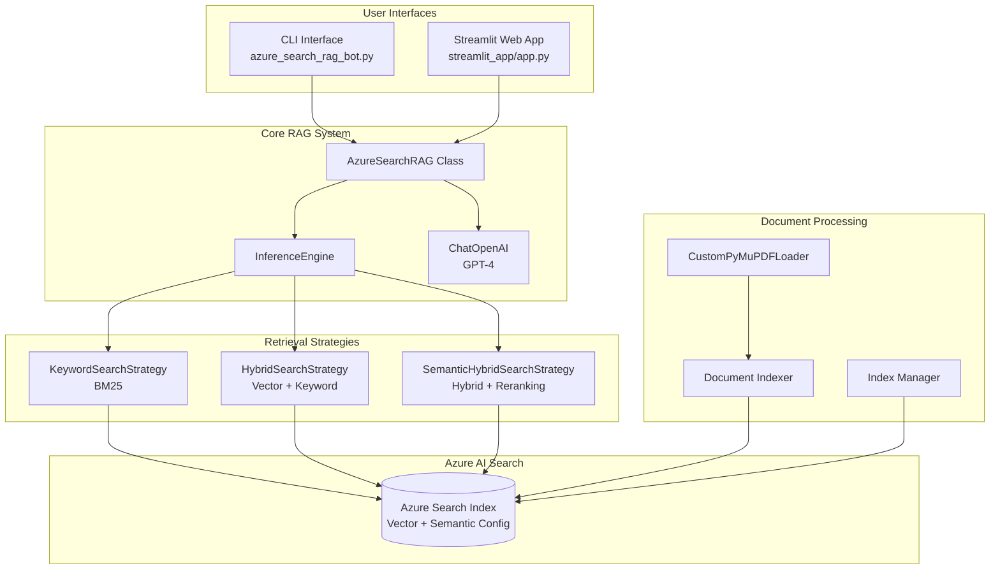
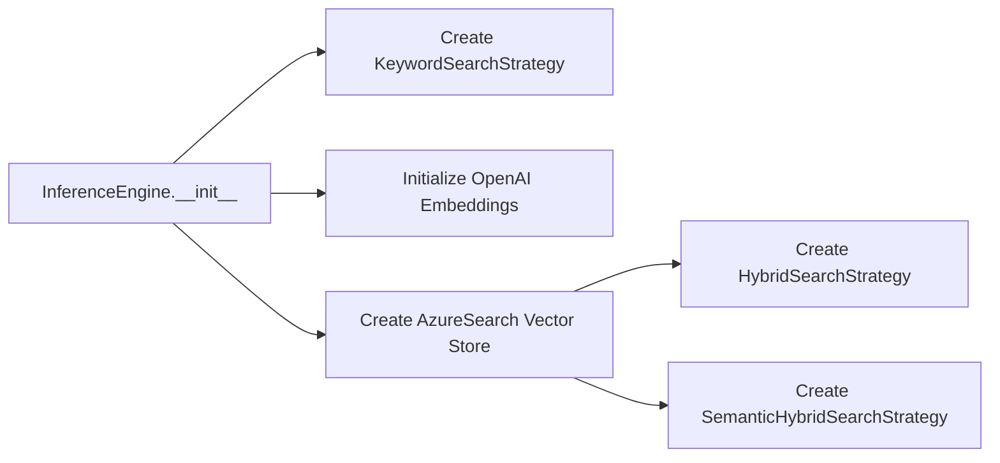
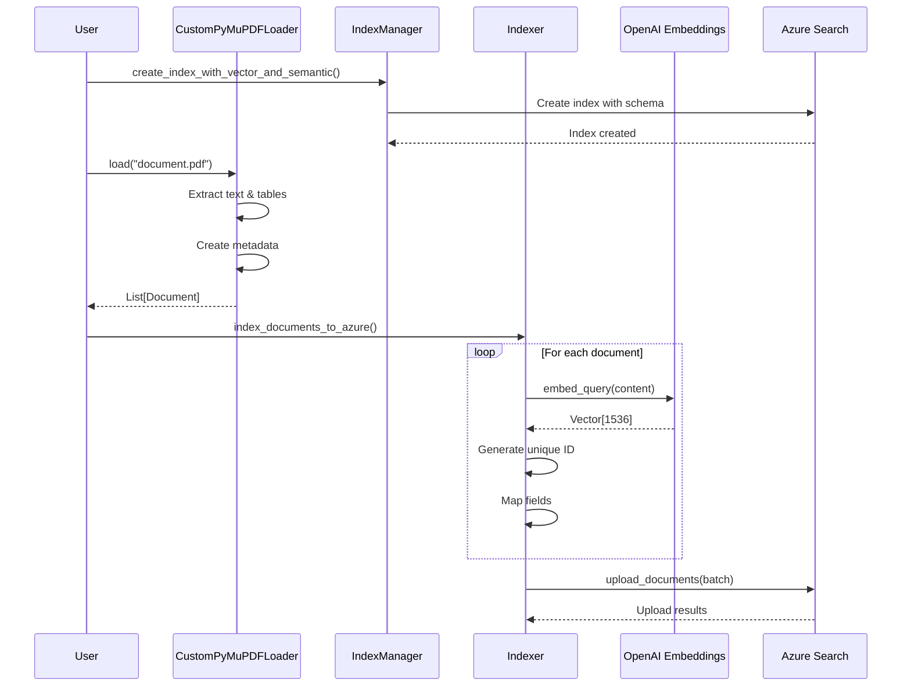
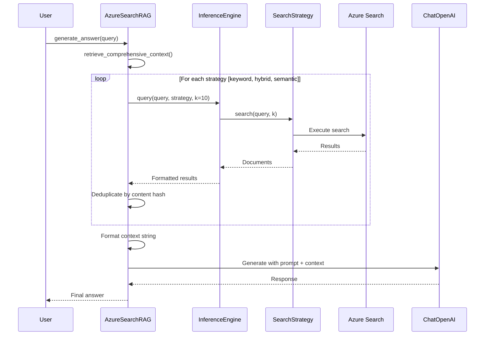

# Azure AI Search Hybrid RAG - Comprehensive Design for enterprise production

## 📋 Project Overview

This project implements a **Retrieval-Augmented Generation (RAG)** system using **Azure AI Search** with multiple retrieval strategies. It provides both a command-line interface and a professional Streamlit web application for querying indexed documents.

### Key Features

- **Multiple Search Strategies**: Keyword (BM25), Hybrid (Vector + Keyword), and Semantic (Hybrid + Reranking)
- **Advanced PDF Processing**: Table extraction and comprehensive metadata capture using PyMuPDF
- **Vector Search**: OpenAI embeddings with HNSW algorithm for efficient similarity search
- **Semantic Search**: Azure's semantic ranker for improved relevance
- **Modular Architecture**: Clean separation of concerns with reusable components
- **Interactive UI**: Professional Streamlit interface with streaming responses and source attribution

---

## 🏗️ Architecture Overview



---

## 📦 Project Structure

```
Azure-AI-Search-Hybrid-RAG/
├── azure_search_rag/              # Core package
│   ├── __init__.py                # Package exports
│   ├── config.py                  # Configuration management
│   ├── loaders.py                 # PDF document loaders
│   ├── retrievers.py              # Search strategy implementations
│   ├── engine.py                  # Inference engine facade
│   ├── indexer.py                 # Document indexing operations
│   └── index_manager.py           # Index creation & management
├── streamlit_app/                 # Web interface
│   ├── app.py                     # Main Streamlit application
│   ├── utils.py                   # Helper functions
│   └── style.css                  # Custom CSS styling
├── azure_search_rag_bot.py        # CLI interface
├── requirements.txt               # Python dependencies
├── .env                           # Environment variables
└── Data/                          # PDF documents directory
```

---

## 🔧 Core Components

### 1. Configuration Management ([config.py](file:///c:/Users/SNEHAN/Desktop/Langgraph/Azure-AI-Search-Hybrid-RAG/azure_search_rag/config.py))

**Purpose**: Centralized configuration loading and validation.

**Key Class**: `AzureSearchConfig`

```python
class AzureSearchConfig:
    - openai_api_key: OpenAI API key for embeddings and LLM
    - azure_search_endpoint: Azure Search service URL
    - azure_search_key: Azure Search admin key
    - azure_search_index_name: Target index name
    - embedding_model: OpenAI embedding model (default: text-embedding-3-small)
    - embedding_dimensions: Vector dimensions (default: 1536)
```

**Key Function**: `verify_configuration()`
- Loads environment variables from `.env`
- Validates all required credentials
- Returns validated config object
- Displays masked configuration for security

---

### 2. Document Loading ([loaders.py](file:///c:/Users/SNEHAN/Desktop/Langgraph/Azure-AI-Search-Hybrid-RAG/azure_search_rag/loaders.py))

**Purpose**: Advanced PDF parsing with table extraction.

**Key Class**: `CustomPyMuPDFLoader`

**Features**:
- **Text Extraction**: Uses PyMuPDF for high-quality text extraction
- **Table Detection**: Automatically finds and extracts tables
- **Rich Metadata**: Captures page dimensions, image counts, document properties
- **Per-Page Processing**: Creates one Document object per page

**Metadata Captured**:
```python
{
    "source": "path/to/file.pdf",
    "page": 1,                    # 1-indexed for display
    "page_number": 0,             # 0-indexed for processing
    "total_pages": 50,
    "page_width": 612.0,
    "page_height": 792.0,
    "image_count": 3,
    "title": "Document Title",
    "author": "Author Name",
    "subject": "Subject",
    "keywords": "keywords",
    "creator": "PDF Creator",
    "producer": "PDF Producer"
}
```

**Usage Example**:
```python
from azure_search_rag import CustomPyMuPDFLoader

loader = CustomPyMuPDFLoader("document.pdf")
documents = loader.load()  # Returns List[Document]
```

---

### 3. Search Strategies ([retrievers.py](file:///c:/Users/SNEHAN/Desktop/Langgraph/Azure-AI-Search-Hybrid-RAG/azure_search_rag/retrievers.py))

**Purpose**: Implement different retrieval approaches.

**Base Class**: `SearchStrategy` (Abstract)

#### Strategy 1: Keyword Search
**Class**: `KeywordSearchStrategy`

- **Algorithm**: BM25 (Best Match 25)
- **Use Case**: Traditional full-text search
- **Pros**: Fast, interpretable, works well for exact matches
- **Cons**: No semantic understanding

```python
# Uses Azure Search SDK directly
results = client.search(
    search_text=query,
    top=k,
    select=["content", "metadata", "source", "page", ...]
)
```

#### Strategy 2: Hybrid Search
**Class**: `HybridSearchStrategy`

- **Algorithm**: Vector similarity + BM25 (RRF fusion)
- **Use Case**: Balanced semantic and keyword matching
- **Pros**: Best of both worlds, robust performance
- **Cons**: Requires embeddings

```python
# Uses LangChain's AzureSearch wrapper
documents = vector_store.hybrid_search(query=query, k=k)
```

#### Strategy 3: Semantic Hybrid Search
**Class**: `SemanticHybridSearchStrategy`

- **Algorithm**: Hybrid + Azure Semantic Ranker
- **Use Case**: Maximum relevance for complex queries
- **Pros**: State-of-the-art relevance, understands intent
- **Cons**: Higher latency, requires semantic configuration

```python
# Uses LangChain with semantic reranking
documents = vector_store.semantic_hybrid_search(query=query, k=k)
```

---

### 4. Inference Engine ([engine.py](file:///c:/Users/SNEHAN/Desktop/Langgraph/Azure-AI-Search-Hybrid-RAG/azure_search_rag/engine.py))

**Purpose**: High-level facade for executing queries.

**Key Class**: `InferenceEngine`

**Responsibilities**:
1. Initialize all search strategies
2. Manage embeddings and vector store
3. Provide unified query interface
4. Standardize result format

**Key Method**: `query(query: str, strategy: str, k: int)`

```python
engine = InferenceEngine(config)

# Execute query with any strategy
results = engine.query(
    query="What is Azure AI Search?",
    strategy="semantic",  # or "keyword", "hybrid"
    k=5
)

# Standardized result format
for result in results:
    print(result["content"])      # Document text
    print(result["metadata"])     # Source metadata
    print(result["score"])        # Relevance score
    print(result["strategy"])     # Strategy used
```

**Initialization Flow**:


---

### 5. Document Indexing ([indexer.py](file:///c:/Users/SNEHAN/Desktop/Langgraph/Azure-AI-Search-Hybrid-RAG/azure_search_rag/indexer.py))

**Purpose**: Upload documents to Azure Search with embeddings.

**Key Function**: `index_documents_to_azure()`

**Process**:
1. **Generate Embeddings**: Create vector for each document
2. **Create Unique IDs**: MD5 hash of source + page + chunk
3. **Map Fields**: Ensure all index fields are populated
4. **Batch Upload**: Upload in configurable batch sizes (default: 100)

**Field Mapping**:
```python
{
    "id": "unique_md5_hash",
    "content": "document text",
    "content_vector": [0.1, 0.2, ...],  # 1536 dimensions
    "metadata": "{...}",                 # JSON string
    "source": "file.pdf",
    "page": 1,
    "title": "Document Title",
    "author": "Author Name",
    "chunk_id": 0
}
```

**Error Handling**:
- Continues on individual document failures
- Reports batch success/failure counts
- Logs specific error messages for debugging

---

### 6. Index Management ([index_manager.py](file:///c:/Users/SNEHAN/Desktop/Langgraph/Azure-AI-Search-Hybrid-RAG/azure_search_rag/index_manager.py))

**Purpose**: Create and manage Azure Search indexes.

**Key Class**: `AzureSearchIndexManager`

**Key Method**: `create_index_with_vector_and_semantic()`

**Index Configuration**:

#### Fields
- `id` (String, Key): Unique document identifier
- `content` (Searchable String): Main document text
- `content_vector` (Vector): 1536-dimensional embedding
- `metadata` (Searchable String): JSON metadata
- `source` (String, Filterable): Source file path
- `page` (Int32, Filterable, Sortable): Page number
- `title` (Searchable String): Document title
- `author` (Searchable String): Document author
- `chunk_id` (Int32): Chunk identifier

#### Vector Search Configuration
```python
HnswAlgorithmConfiguration(
    name="myHnsw",
    parameters={
        "m": 4,                    # Bi-directional links
        "efConstruction": 400,     # Build-time accuracy
        "efSearch": 500,           # Query-time accuracy
        "metric": "cosine"         # Similarity metric
    }
)
```

#### Semantic Configuration
```python
SemanticConfiguration(
    name="my-semantic-config",
    prioritized_fields={
        "title_field": "title",
        "content_fields": ["content"],
        "keywords_fields": ["metadata", "author"]
    }
)
```

---

## 🔄 Data Flow

### Indexing Flow



### Query Flow



---

## 💻 Implementation Details

### RAG System ([azure_search_rag_bot.py](file:///c:/Users/SNEHAN/Desktop/Langgraph/Azure-AI-Search-Hybrid-RAG/azure_search_rag_bot.py))

**Class**: `AzureSearchRAG`

**Initialization**:
```python
def __init__(self):
    # 1. Load and validate configuration
    self.config = verify_configuration()
    
    # 2. Initialize retrieval engine
    self.engine = InferenceEngine(self.config)
    
    # 3. Initialize LLM for generation
    self.llm = ChatOpenAI(
        api_key=self.config.openai_api_key,
        model_name="gpt-4.1-nano",
        temperature=0.4
    )
    
    # 4. Define generation prompt
    self.prompt = ChatPromptTemplate.from_template(...)
```

**Key Method**: `retrieve_comprehensive_context()`

**Strategy**:
1. Query all three strategies in parallel
2. Deduplicate results using content hashing
3. Preserve strategy metadata for transparency
4. Format into structured context string

```python
def retrieve_comprehensive_context(self, query: str, k_per_strategy: int = 10):
    strategies = ["keyword", "hybrid", "semantic"]
    all_results = []
    seen_content_hashes = set()
    
    for strategy in strategies:
        results = self.engine.query(query, strategy=strategy, k=k_per_strategy)
        
        for res in results:
            content_hash = hash(res['content'])
            if content_hash not in seen_content_hashes:
                seen_content_hashes.add(content_hash)
                res['_source_strategy'] = strategy
                all_results.append(res)
    
    # Format: --- Document {i} (Source: {source}, Strategy: {strategy}) ---
    return format_context(all_results)
```

**Generation Pipeline**:
```python
def generate_answer(self, query: str):
    # 1. Retrieve context
    context = self.retrieve_comprehensive_context(query)
    
    # 2. Build chain
    chain = (
        {"context": lambda x: context, "question": RunnablePassthrough()}
        | self.prompt
        | self.llm
        | StrOutputParser()
    )
    
    # 3. Generate response
    return chain.invoke(query)
```

---

### Streamlit Application ([streamlit_app/app.py](file:///c:/Users/SNEHAN/Desktop/Langgraph/Azure-AI-Search-Hybrid-RAG/streamlit_app/app.py))

**Features**:
- **Streaming Responses**: Real-time token-by-token generation
- **Progress Tracking**: Visual feedback for retrieval and generation
- **Source Attribution**: Expandable source citations
- **Conversation History**: Persistent chat memory
- **Custom Styling**: Professional CSS animations

**Key Components**:

#### 1. Initialization
```python
# Cache RAG system (singleton pattern)
@st.cache_resource
def get_rag_system():
    return AzureSearchRAG()

rag = get_rag_system()
```

#### 2. User Input Handling
```python
if prompt := st.chat_input("Ask a question..."):
    # Add to history
    st.session_state.messages.append({"role": "user", "content": prompt})
    
    # Display user message
    with st.chat_message("user"):
        st.markdown(prompt)
```

#### 3. Response Generation with Progress
```python
with st.chat_message("assistant"):
    with st.status("Thinking...", expanded=True) as status:
        # Step 1: Retrieval
        st.write("🔍 Retrieving relevant documents...")
        context = rag.retrieve_comprehensive_context(prompt, k_per_strategy=retrieval_limit)
        sources_data = utils.format_source_display(context)
        st.write(f"✅ Found {len(sources_data)} relevant segments.")
        
        # Step 2: Generation
        st.write("🧠 Generating response...")
        chunks = utils.stream_response(rag, prompt, context)
        
        for chunk in chunks:
            full_response += chunk
            response_placeholder.markdown(full_response + "▌")
        
        status.update(label="Complete", state="complete")
```

#### 4. Source Display
```python
if sources_data:
    with st.expander("Explore Retrieved Sources"):
        for idx, source in enumerate(sources_data, 1):
            st.markdown(f"**{idx}. {source['source']}** ({source['strategy']})")
            st.caption(source['content'][:200] + "...")
```

**Utility Functions** ([streamlit_app/utils.py](file:///c:/Users/SNEHAN/Desktop/Langgraph/Azure-AI-Search-Hybrid-RAG/streamlit_app/utils.py)):

- `load_css()`: Inject custom CSS
- `get_rag_system()`: Cached RAG initialization
- `format_source_display()`: Parse context into structured sources
- `stream_response()`: Stream LLM tokens for real-time display

---

## 🚀 Usage Guide

### Prerequisites

**Required Environment Variables** (`.env`):
```bash
OPENAI_API_KEY=sk-...
AZURE_SEARCH_ENDPOINT=https://your-service.search.windows.net
AZURE_SEARCH_KEY=your-admin-key
AZURE_SEARCH_INDEX_NAME_2=your-index-name
EMBEDDING_MODEL=text-embedding-3-small
EMBEDDING_DIMENSIONS=1536
```

**Install Dependencies**:
```bash
pip install -r requirements.txt
```

### 1. Create Index

```python
from azure_search_rag import AzureSearchConfig, AzureSearchIndexManager

config = AzureSearchConfig()
config.validate()

manager = AzureSearchIndexManager(
    endpoint=config.azure_search_endpoint,
    key=config.azure_search_key,
    index_name=config.azure_search_index_name
)

# Create index with vector and semantic search
manager.create_index_with_vector_and_semantic(
    embedding_dimensions=1536
)
```

### 2. Index Documents

```python
from azure_search_rag import CustomPyMuPDFLoader, index_documents_to_azure
from langchain_openai import OpenAIEmbeddings

# Load PDF
loader = CustomPyMuPDFLoader("Data/document.pdf")
documents = loader.load()

# Initialize embeddings
embeddings = OpenAIEmbeddings(
    openai_api_key=config.openai_api_key,
    model="text-embedding-3-small"
)

# Index documents
index_documents_to_azure(
    documents=documents,
    embeddings=embeddings,
    endpoint=config.azure_search_endpoint,
    index_name=config.azure_search_index_name,
    key=config.azure_search_key,
    batch_size=100
)
```

### 3. Query via CLI

```bash
python azure_search_rag_bot.py
```

**Example Interaction**:
```
Welcome to Azure Search RAG (All-Strategies)
============================================================
Type 'exit' or 'quit' to stop.

Enter your question: What is Azure AI Search?

🔍 Retrieving context for: 'What is Azure AI Search?'
   - Running keyword search...
   - Running hybrid search...
   - Running semantic search...
   => Total unique documents retrieved: 15

🤖 Generating answer...

------------------------------------------------------------
ANSWER:
Azure AI Search is a cloud-based search service that provides...
------------------------------------------------------------
```

### 4. Query via Streamlit

```bash
cd streamlit_app
streamlit run app.py
```

**Features**:
- Interactive chat interface
- Adjustable retrieval settings (slider for document count)
- Real-time streaming responses
- Source citations with strategy attribution
- Conversation history
- Clear conversation button

---

## 🔍 Key Design Patterns

### 1. Strategy Pattern
**Location**: [retrievers.py](file:///c:/Users/SNEHAN/Desktop/Langgraph/Azure-AI-Search-Hybrid-RAG/azure_search_rag/retrievers.py)

All search strategies implement the `SearchStrategy` abstract base class, allowing the engine to switch between them seamlessly.

### 2. Facade Pattern
**Location**: [engine.py](file:///c:/Users/SNEHAN/Desktop/Langgraph/Azure-AI-Search-Hybrid-RAG/azure_search_rag/engine.py)

`InferenceEngine` provides a simplified interface to the complex retrieval subsystem.

### 3. Singleton Pattern
**Location**: [streamlit_app/utils.py](file:///c:/Users/SNEHAN/Desktop/Langgraph/Azure-AI-Search-Hybrid-RAG/streamlit_app/utils.py)

`@st.cache_resource` ensures only one RAG system instance is created and reused.

### 4. Template Method Pattern
**Location**: [azure_search_rag_bot.py](file:///c:/Users/SNEHAN/Desktop/Langgraph/Azure-AI-Search-Hybrid-RAG/azure_search_rag_bot.py)

`generate_answer()` defines the RAG pipeline structure (retrieve → format → generate) while allowing customization of each step.

---

## 📊 Performance Considerations

### Retrieval Performance

| Strategy | Latency | Relevance | Use Case |
|----------|---------|-----------|----------|
| Keyword | ~50ms | Good for exact matches | Known terminology |
| Hybrid | ~100ms | Excellent balance | General queries |
| Semantic | ~200ms | Best relevance | Complex questions |

### Optimization Techniques

1. **Deduplication**: Content hashing prevents redundant results
2. **Batch Indexing**: Upload 100 documents at a time
3. **Caching**: Streamlit caches RAG system initialization
4. **HNSW Parameters**: Tuned for balance of speed/accuracy
   - `m=4`: Lower memory, faster search
   - `efSearch=500`: High recall

### Scalability

- **Index Size**: Supports millions of documents
- **Concurrent Queries**: Azure Search handles multiple users
- **Embedding Caching**: Consider caching embeddings for frequently queried documents

---

## 🛠️ Troubleshooting

### Common Issues

#### 1. Import Errors
**Problem**: `ModuleNotFoundError: No module named 'azure_search_rag'`

**Solution**: Ensure you're running from the project root:
```bash
cd Azure-AI-Search-Hybrid-RAG
python azure_search_rag_bot.py
```

#### 2. Configuration Errors
**Problem**: `ValueError: Missing required environment variables`

**Solution**: Check `.env` file has all required variables:
```bash
OPENAI_API_KEY
AZURE_SEARCH_ENDPOINT
AZURE_SEARCH_KEY
AZURE_SEARCH_INDEX_NAME_2
```

#### 3. Indexing Failures
**Problem**: Documents fail to upload

**Solution**: 
- Verify index schema matches document fields
- Check Azure Search quota limits
- Ensure embeddings dimension matches index configuration (1536)

#### 4. Empty Results
**Problem**: No documents retrieved for query

**Solution**:
- Verify index contains documents: Check Azure Portal
- Try different search strategies
- Check query spelling and terminology

---

## 🎯 Best Practices

### 1. Document Preparation
- **Chunk Size**: Keep chunks under 1000 tokens for optimal retrieval
- **Metadata**: Include rich metadata (title, author, date) for better filtering
- **Clean Text**: Remove headers/footers that add noise

### 2. Query Optimization
- **Use All Strategies**: Comprehensive context improves answer quality
- **Adjust k**: Balance between context size and relevance (default: 10 per strategy)
- **Deduplication**: Always deduplicate to avoid redundant context

### 3. Prompt Engineering
- **Clear Instructions**: Tell LLM to only use provided context
- **Fallback Behavior**: Define what to say when information is missing
- **Citation**: Encourage referencing source documents

### 4. Production Deployment
- **Error Handling**: Wrap all external calls in try-except
- **Logging**: Add comprehensive logging for debugging
- **Rate Limiting**: Implement backoff for OpenAI API calls
- **Monitoring**: Track query latency and success rates

---

## 📈 Future Enhancements

### Potential Improvements

1. **Multi-Modal Support**: Add image and table understanding
2. **Query Rewriting**: Expand queries for better retrieval
3. **Conversation Memory**: Maintain context across multiple turns
4. **Citation Linking**: Direct links to source documents
5. **Analytics Dashboard**: Track usage patterns and performance
6. **A/B Testing**: Compare strategy effectiveness
7. **Caching Layer**: Cache frequent queries and embeddings
8. **Feedback Loop**: Collect user ratings to improve retrieval

---

## 📚 Additional Resources

### Documentation
- [Azure AI Search Documentation](https://learn.microsoft.com/en-us/azure/search/)
- [LangChain Documentation](https://python.langchain.com/)
- [OpenAI Embeddings Guide](https://platform.openai.com/docs/guides/embeddings)
- [Streamlit Documentation](https://docs.streamlit.io/)

### Related Concepts
- **RAG**: Retrieval-Augmented Generation
- **BM25**: Best Match 25 ranking function
- **HNSW**: Hierarchical Navigable Small World graphs
- **RRF**: Reciprocal Rank Fusion
- **Semantic Ranking**: Azure's L2 reranking model

---

## 🎓 Summary

This Azure AI Search Hybrid RAG system demonstrates a production-ready implementation of retrieval-augmented generation with the following highlights:

✅ **Modular Architecture**: Clean separation of concerns with reusable components  
✅ **Multiple Retrieval Strategies**: Keyword, Hybrid, and Semantic search  
✅ **Advanced PDF Processing**: Table extraction and rich metadata  
✅ **Professional UI**: Streamlit interface with streaming and source attribution  
✅ **Comprehensive Deduplication**: Content hashing across strategies  
✅ **Production-Ready**: Error handling, validation, and logging  

The system is designed for extensibility, allowing easy addition of new document types, search strategies, or generation models.
