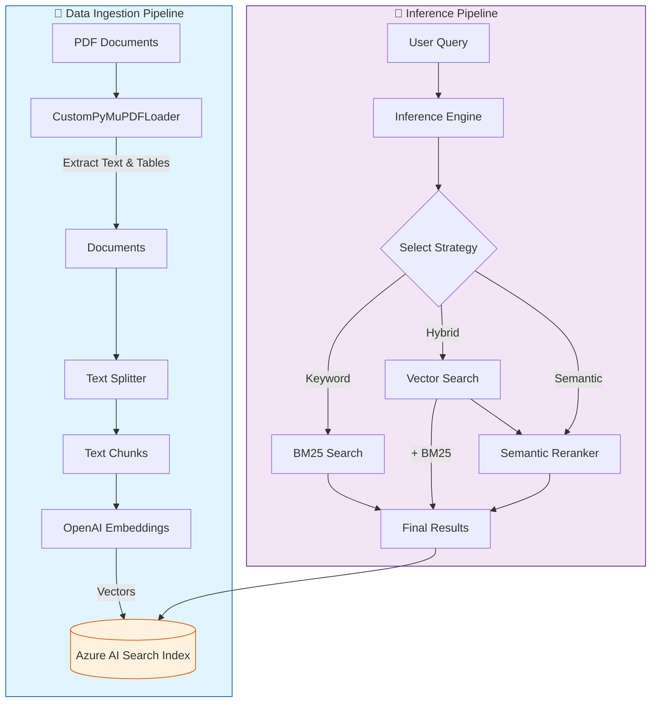

# Azure Search RAG System

A modular, production-ready RAG (Retrieval-Augmented Generation) system built with Azure AI Search and LangChain.

This project provides a robust framework for:
- 📄 **Ingesting** PDF documents with advanced parsing (tables, metadata)
- 🔍 **Indexing** content into Azure AI Search with vector and semantic capabilities
- 🧠 **Retrieving** information using Keyword, Hybrid, and Semantic Hybrid strategies

## Features

- **Advanced PDF Loading**: Uses PyMuPDF to extract text and tables with rich metadata.
- **Azure AI Search Integration**: Full support for Vector Search (HNSW) and Semantic Reranking.
- **Modular Architecture**: Clean separation of concerns (loaders, indexers, retrievers, config).
- **Multiple Search Strategies**:
  - **Keyword**: Traditional BM25 text search.
  - **Hybrid**: Combines vector similarity with keyword limits.
  - **Semantic Hybrid**: Hybrid search + Azure Semantic Reranking (State-of-the-Art).
- **Inference Engine**: High-level facade for easy integration and testing.

## System Architecture



## Prerequisites

- Python 3.10+
- Azure AI Search Service (Basic tier or higher recommended for Semantic Search)
- OpenAI API Key (for embeddings)

## Installation

1. **Clone the repository** (if applicable)

2. **Install dependencies**:
   ```bash
   pip install -r requirements.txt
   ```
   *Note: If `requirements.txt` is missing, install manually:*
   ```bash
   pip install langchain-openai langchain-community langchain-text-splitters
   pip install azure-search-documents azure-core
   pip install pymupdf python-dotenv
   ```

3. **Configure Environment**:
   Create a `.env` file in the root directory:
   ```env
   OPENAI_API_KEY=your_openai_api_key
   AZURE_SEARCH_ENDPOINT=your_azure_search_endpoint
   AZURE_SEARCH_KEY=your_azure_search_admin_key
   AZURE_SEARCH_INDEX_NAME=your_index_name
   EMBEDDING_MODEL=text-embedding-3-small
   EMBEDDING_DIMENSIONS=1536
   ```

## Quick Start

### 1. Index Documents
Use the indexing script to parse your PDF and upload it to Azure Search.

```bash
python azure_search_indexing.py
```
*Modify `azure_search_indexing.py` to point to your specific PDF file.*

### 2. Run Inference
Use the inference demo to query your data using different strategies.

```bash
python azure_search_inference.py
```
*Results will be displayed in the console and saved to `inference_results.txt`.*

## Project Structure

```
.
├── azure_search_indexing.py    # Main script for indexing PDFs
├── azure_search_inference.py   # Main script for testing search queries
├── inference_results.txt       # Log file for search results
├── azure_search_rag/           # Modular Package
│   ├── __init__.py            # Exports
│   ├── config.py              # Configuration & Validation
│   ├── loaders.py             # PDF Parser (PyMuPDF)
│   ├── index_manager.py       # Index Creation & Management
│   ├── indexer.py             # Document Upload Logic
│   ├── retrievers.py          # Search Strategies (Keyword, Hybrid, Semantic)
│   └── engine.py              # Inference Facade
├── Data/                       # Directory for PDF files
└── .env                        # Environment variables
```

## Usage Details

### Indexing (`azure_search_indexing.py`)
This script uses `CustomPyMuPDFLoader` to parse the PDF, splits it into chunks using `RecursiveCharacterTextSplitter`, and initializes the Azure Search index with vector and semantic configurations.

### Inference (`azure_search_inference.py`)
Demonstrates the `InferenceEngine` which abstracts the complexity of switching between search modes.

```python
from azure_search_rag import verify_configuration, InferenceEngine

config = verify_configuration()
engine = InferenceEngine(config)

# Execute Semantic Hybrid Search
results = engine.query("What is the architecture?", strategy="semantic")
```

## Search Strategies Explained

1.  **Keyword (BM25)**: Best for exact matches and specific terminology. Fast and interpretable.
2.  **Hybrid (Vector + Keyword)**: Combines semantic understanding (Vectors) with exact matching (Keyword). Uses Reciprocal Rank Fusion (RRF) to merge scores.
3.  **Semantic Hybrid**: The most advanced mode. Performs Hybrid search first, then uses Azure's Semantic Reranker AI to re-score top results based on reading comprehension.


